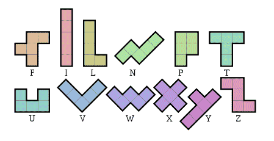
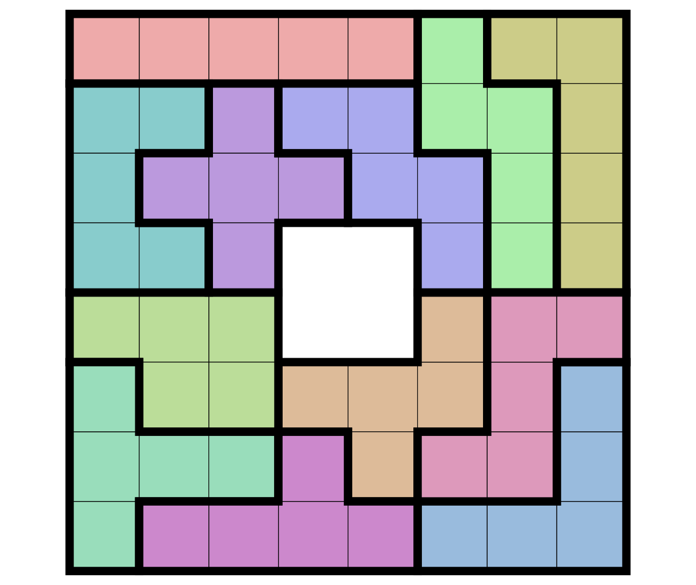
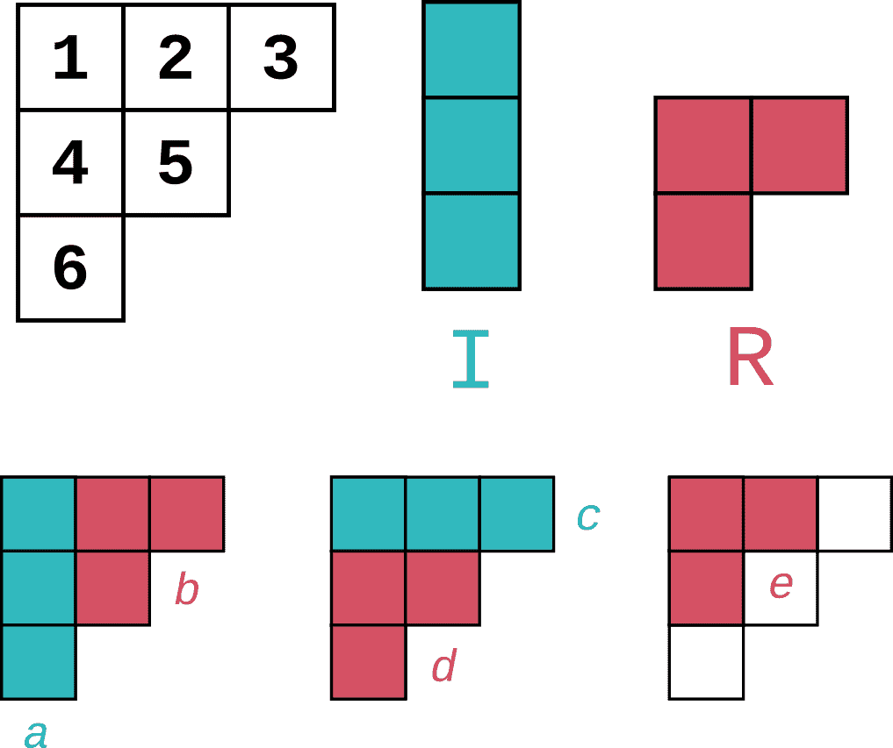
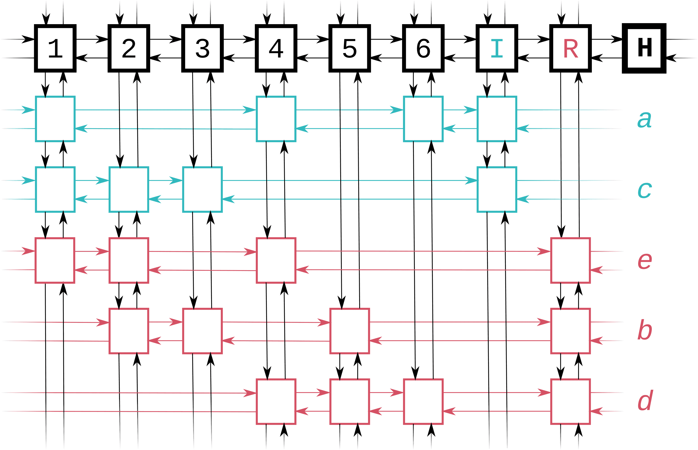

A school project - a simple multithreaded solver for polyomino covering puzzles, written in vanilla Rust.


Introduction
============

An input to the following program consists of 1-bit image in the form of
a block of text (where one specific character, `x` by default,
represents a filled pixel and the rest of the characters represent an
unfilled pixel) and a list of 1-bit shapes - polyomino tiles. The
program, then (according to the user's choice) finds one or all possible
covers of the image by the polyomino tiles.


|  |  |
| -------- | -------- |
| Example: pentomino tiles     | One cover by pentomino tiles      |


Building and running
====================

As usual with Rust and Cargo, compile with `cargo build` or run the optimised version 
with `cargo run --release`.

The program consists of a library (at `src/lib.rs`), where all the
application logic is located and a binary (at `src/main.rs`), which is
just a wrapper around the library passing command line arguments to it.
The library has no external dependencies. The binary has one external
dependency, `structopt` crate for parsing the command line arguments
(unfortunately, in the present state dependencies for binary only can't
be specified in the Cargo config).

Input
=====

The program reads text from the input and interprets it as 1-bit image
(every line of the text represents a line of pixels in the image, the
character `wchar` represents a white or filled pixel and any other
character represents a black or empty pixel; every line is completed
with empty pixels to the length of the largest line). The maximum
allowed width and height of the image is 255 pixels.

For the given image, the program finds all the covers by the polyomino
blocks defined in `blockfile`. The program perceives some isomorphic
covers (with respect to rotation or reflection) as separate covers.

The input needs to be a valid UTF-8 text. The program runs through
separate characters (opposed to the *grapheme clusters*, usually
perceived as separate letters), so it is recommended to only use the
characters that are displayed separately.

Command line arguments
======================

```text
FLAGS:
    -r, --allow-repeat    Allow repetition of blocks
    -O, --one             Finish after finding the first solution
    -h, --help            Prints help information
    -A, --all             Print all solutions
    -V, --version         Prints version information

OPTIONS:
    -b <blockfile>        Load blocks from <blockfile> [default: tiles/pentomino]
    -i <inputfile>        Read input from <inputfile>, defaults to standard input
    -w <wchar>            Interpret <wchar> as "filled" pixel in the input [default: x]
```

Sample images, resp. sets of blocks can be found in `images/`, resp. `tiles/` directory.

In the `blockfile`, every lines represents one rendition of some
polyomino tile. The first character of the line identifies the class of
the tile. Every tile consists of at least one pixel, implicitly located
at the coordinates `[0,0]`. If the tile consists of more than one pixel,
the identifier is followed by tuples of their x and y coordinates,
separated by whitespace (max. 255). If the repetition is not allowed (by
the `-r` flag), there can be at most one tile from every class used.
This way, for example, rotations and reflections of a tile can be
practically considered as the same tile. E.g. the pentomino tile **P**
can be in with all of its isomorphisms denoted as:
```
P 1 0 0 1 1 1 0 2 
P 1 0 2 0 1 1 2 1 
P 1 0 0 1 1 1 2 1 
P -1 1 0 1 -1 2 0 2 
P 1 0 0 1 1 1 1 2 
P 1 0 2 0 0 1 1 1 
P 1 0 -1 1 0 1 1 1 
P 0 1 1 1 0 2 1 2 
```
Tiles belonging to the same class of tiles can be arbitrary, though.

Examples
========

` $ cargo run --release `

    xxxxxxxx
    xxxxxxxx
    xxxxxxxx
    xxx..xxx
    xxx..xxx
    xxxxxxxx
    xxxxxxxx 
    xxxxxxxx

Output:

    +-+-+-+-+-+-+-+-+
    |U U|X|N N N|L L|
    + +-+ +-+-+ +-+ +
    |U|X X X|F|N N|L|
    + +-+ +-+ +-+-+ +
    |U U|X|F F F|T|L|
    +-+-+-+-+-+ + + +
    |I|Z Z|   |F|T|L|
    + +-+ +   +-+ +-+
    |I|Y|Z|   |T T T|
    + + + +-+-+-+-+-+
    |I|Y|Z Z|W|V V V|
    + + +-+-+ +-+-+ +
    |I|Y Y|W W|P P|V|
    + + +-+ +-+   + +
    |I|Y|W W|P P P|V|
    +-+-+-+-+-+-+-+-+

    520 solutions found in 330.248448ms

` $ cargo run --release -- -Or -w f`

    fffff
    .fffff
    ..fffff
    ...fffff
    ..fffff

Output:

    +-+-+-+-+-+
    |L L L L|N|
    +-+-+-+ + +-+
      |N N|L|N N|
      +-+ +-+-+ +-+
        |N N N|N|F|
        +-+-+-+ + +-+
          |P P|N|F F|
        +-+   +-+ +-+
        |P P P|F F|
        +-+-+-+-+-+

    1 solution found in 1.044474ms
    

Algorithm
=======
The program is based on the [dancing links](https://arxiv.org/abs/cs/0011047)  technique.
We store all the possible placements of one tile on the image in a special data structure, akin 
to 2D linked list, as shown below.

|  |  |
| -------- | -------- |
| Possible placements of trominos in an image     | The linkage structure storing them      |

Using this structure, the program pretty much places tiles one by one onto the image (starting with ones that have the least possible placements), eliminates the placements that are no longer possible, until it either finds a solution or a dead end. Then, it returns to the previous state, which is can be done fast with linked lists.

The whole structure is completely memory safe. The first few branches of possibilities are divided between separate threads (the structure is cloned for each), so the whole tree of solutions is searched through in parallel.

Performance
=======

Various tests can be run using `cargo test –-release`, testing all the
options. Currently, the program passes every test.

All the benchmarks were done at the author's computer (2011 Intel Core
i5-2400S @ 2.66GHz, 4 physical cores). As the pentomino covers are the ones 
the polyomino solvers are most often written for, they were the ones to be tested.

For the following images, the code runs quickly enough to allow
statistically fairly accurate benchmarking (using the Cargo benchmarking
tool). If you use the nightly version of the Rust toolchain, you can run these using `cargo bench`.
```text
    pentomino, 20x3 rectangle: 67,873,340ns/run (+/- 9,544,170)
    pentomino, 8x8 square 2x2 hole in the middle: 320,052,720ns/run (+/- 10,539,585)
```
For these images, the benchmarking process would take too long to palate
(as many iterations are required for the accuracy), so for the following
images, mere random samples are provided. Nevertheless, the actual
results were in 10% accuracy range.
```text
    pentomino, 15x4 rectangle: 863.717ms
    pentomino, 12x5 rectangle: 2.319s
    pentomino, 10x6 rectangle: 4.046s
    pentomino + 2x2 square: 38.732s
```
It should be noted that this program finds all solutions, including
isomorphic ones. If the linkage was constructed in a certain way
respecting the isomorphisms, the performance could be improved up to
8-fold (for the cases with the most isomorphisms).


